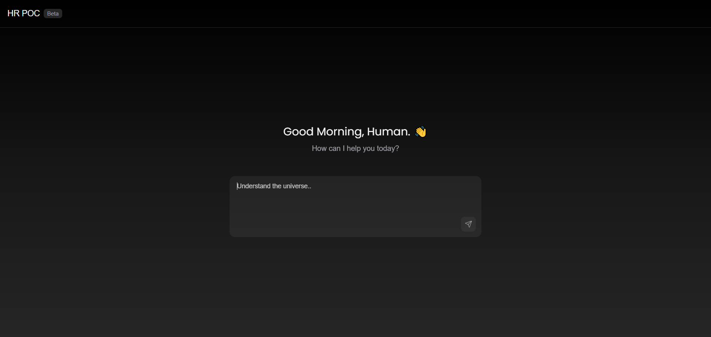
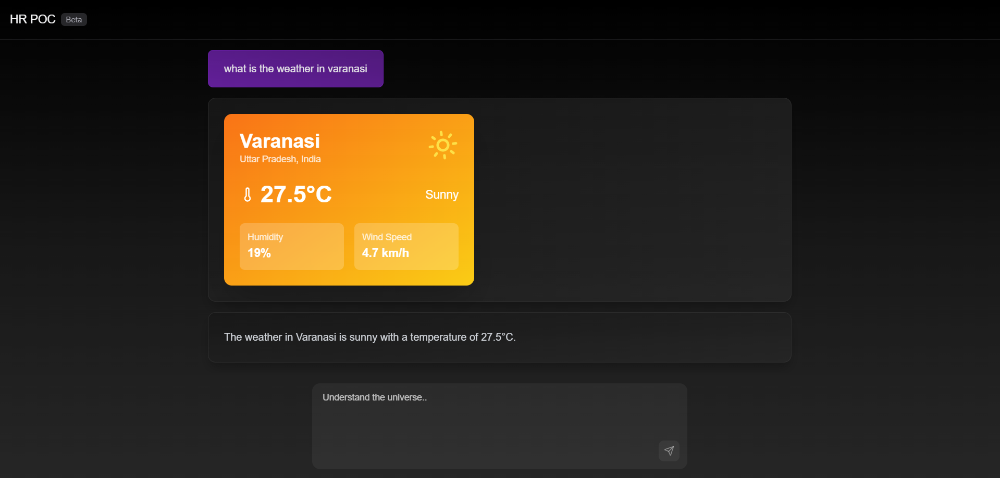
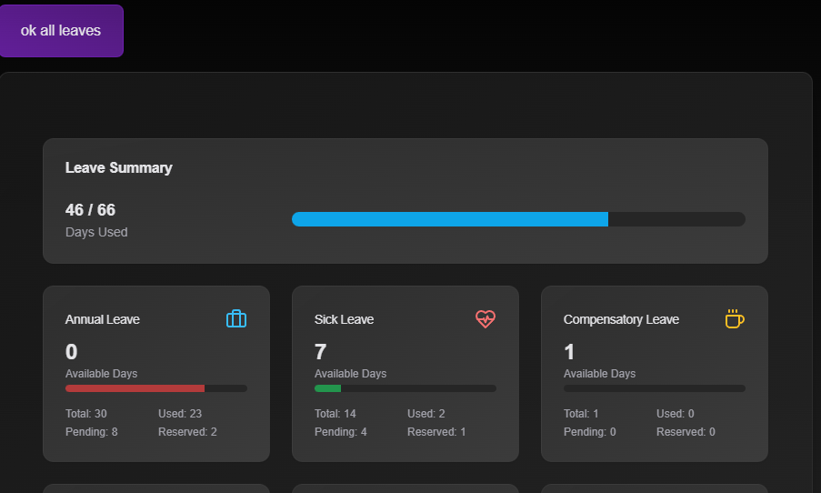
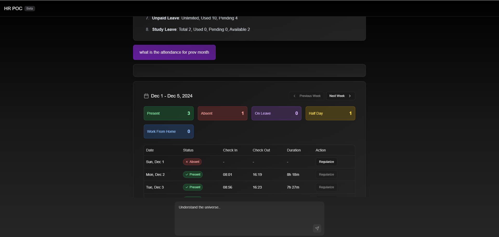

# HR POC

A modern HR management system with AI-powered chat interface, leave management, and attendance tracking.
UI inspired from Grok






## Tech Stack

### Core

- Next.js 14

- AI SDK

- TypeScript

- Tailwind CSS

### UI/UX

- Framer Motion (animations)

- shadcn/ui (UI components)

- Lucide Icons

- React Markdown

## Features

- 🤖 AI Chat Interface

- 📊 Leave Management [TOOL CALL]

- 📅 Attendance Tracking [TOOL CALL]

- 🌤 Weather Integration [TOOL CALL]

## Getting Started

1. Clone and install:

```bash

git clone https://github.com/yourusername/hr-poc.git

cd hr-poc

npm install

```

2. Setup environment:

```bash

cp .env.example .env.local

```

3. Configure variables:

```env

AZURE_OPENAI_API_KEY=your_key

AZURE_OPENAI_ENDPOINT=your_endpoint

WEATHER_API_KEY=your_key

```

4. Run development server:

```bash

npm run dev

```
